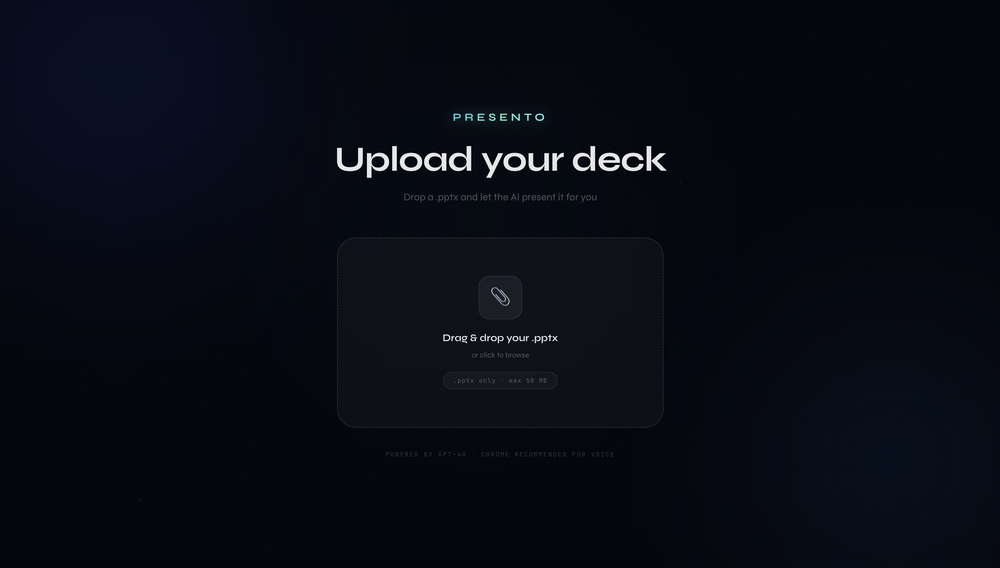
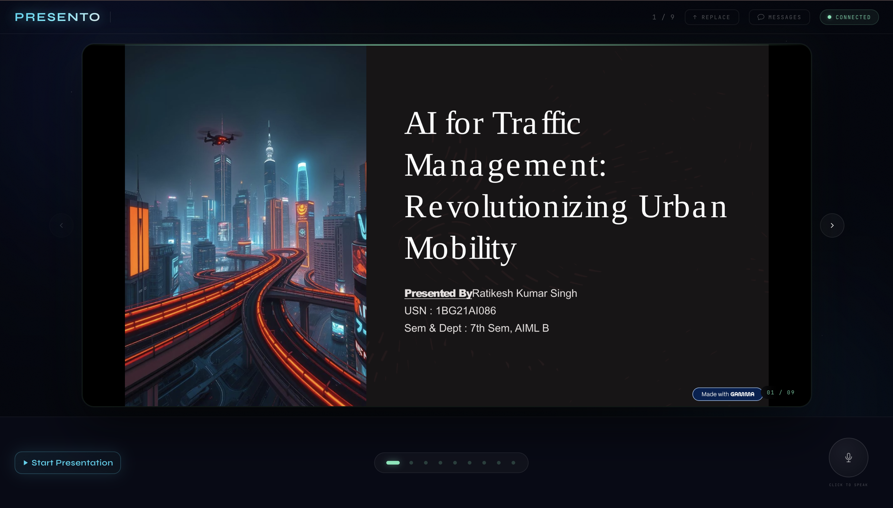

# PRESENTO Frontend

Frontend client for **PRESENTO - an AI presentation agent**.

This application provides the user-facing presentation experience: upload, live slide rendering, voice interaction, and synchronization with backend agent events.

## What This App Does

- Uploads `.pptx` files to the backend.
- Displays parsed slide data with rendered image assets.
- Maintains a persistent WebSocket session for live presentation control.
- Supports voice-driven interruptions (questions/doubts) while presenting.
- Plays AI narration using browser speech synthesis.

## Basic System Design

### UI and State Layers

- `src/components/Uploadscreen.tsx`: upload flow and stateful UI.
- `src/hooks/usePresentation.ts`: primary presentation state controller.
- `src/hooks/useWebSocket.ts`: WebSocket lifecycle and reconnect logic.
- `src/hooks/useVoice.ts`: speech recognition + speech synthesis wrapper.
- `src/slides/slideData.ts`: API upload call, response shaping, and slide enrichment.

### Frontend Workflow

1. User uploads a deck in the upload screen.
2. Frontend posts file to backend `POST /upload`.
3. Backend returns `session_id` and parsed slides.
4. Frontend connects to WebSocket and sends `load_deck`.
5. User starts the session; frontend sends `start_presentation`.
6. Backend pushes `change_slide`, `speak`, and `status`; UI updates in real time.
7. User interruption triggers `user_speech`, backend handles doubt flow, then resumes presentation.

## UI Screenshots

Store screenshots in `frontend/public/screenshots/`. The README currently uses:

- `upload-screen.png`
- `presentation-screen.png`

Gallery:




## Demo Video

🎥 **[Watch Demo on Google Drive](https://drive.google.com/file/d/1sCbdme3eqGgLiYSuIdM89lmmLpLjkvlp/view?usp=sharing)**

## Prerequisites

- Node.js 18+ recommended
- pnpm

## Environment Configuration

```bash
cp .env.example .env
```

Expected variables:

```env
VITE_WS_URL=ws://localhost:8000/ws
VITE_API_URL=http://localhost:8000
```

## Installation

From `frontend/`:

```bash
pnpm install
```

## Run in Development

```bash
pnpm dev
```

Default URL: `http://localhost:5173`

## Build and Preview

```bash
pnpm build
pnpm preview
```

## Browser Notes

- Microphone permission is required for speech recognition.
- Available TTS voices depend on browser and operating system.

## Backend Dependency

Frontend requires the backend to be reachable at:

- `VITE_API_URL`
- `VITE_WS_URL`
